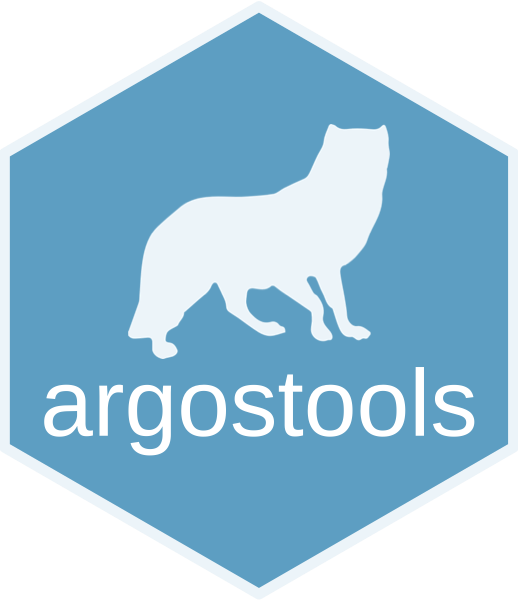

<!-- README.md is generated from README.Rmd. Please edit that file -->

# argostools 

<!-- badges: start -->

[](https://travis-ci.org/ahasverus/argostools)
[](https://ci.appveyor.com/project/ahasverus/argostools)
[](https://www.tidyverse.org/lifecycle/#stable)
[](https://opensource.org/licenses/MIT)
[](https://zenodo.org/badge/latestdoi/37935776)
<!-- badges: end -->

This package provides functions to import (xls(x), txt, csv and diag
extensions) and format Argos data (coordinates and date fields). Some
filters are also available (spatial, temporal and speed-based filters)
to clean up locations. After compilation, data can be passed under an
SQL structure using several functions (database creation, relation
update, extraction queries, etc.)

## Installation

You can install the dev version of argostools from
[GitHub](https://github.com/ahasverus/argostools) with:

``` r
devtools::install_github("ahasverus/argostools", build_vignettes = TRUE)
```

## Getting started

``` r
library(argostools)
ls("package:argostools")
```

Main functions to be used in order:

  - `pg_extract_locs()`
  - `temporal_buffer()`
  - `spatial_buffer()`
  - `speed_filter()`

Enjoy\!
